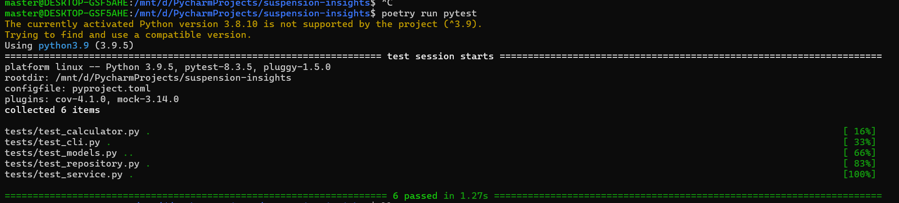

# Suspension Insights

## Overview
The **Days From Suspension Report** system processes payment logs to calculate a client's remaining days until suspension. Additionally, it generates reports on agent collections and total collections by payment type.

## Features
- Computes **days from suspension** for each client.
- Generates an **agent collection report** detailing collections per agent, per day, and per payment type.
- Produces a **payment type report** summarizing total collections by payment type.
- Supports **CSV input and output** for easy integration.
- Implements **SOLID principles, clean architecture, and scalable design**.

## Requirements
- Python 3.9+
- Poetry (for dependency management)
- Pandas (for data processing)
- Click (for CLI implementation)

## Installation
### Install Poetry
If you haven't installed Poetry yet, run:
```sh
curl -sSL https://install.python-poetry.org | python3 -
```
Then, ensure Poetry is added to your PATH:
```sh
echo "export PATH=\"$HOME/.local/bin:\$PATH\"" >> ~/.bashrc
source ~/.bashrc
```

### Clone the repository and install dependencies using Poetry:
```sh
git clone https://github.com/liyabonasaki/suspension-insights.git
cd suspension-insights
poetry install
```

## Running the Program
- cd to suspension_insights directory
- Execute the program by providing an input CSV file and an output folder:
```sh
poetry run python -m cli 2024_09_10_payments.csv reports
```


This will generate three reports in the specified `output_folder`:
1. `days_from_suspension_report.csv` - Lists clients and their days from suspension.
2. `agent_collection_report.csv` - Displays collections per agent, per day, and per payment type.
3. `payment_type_report.csv` - Summarizes total collections by payment type.

## Running Tests
Run unit tests using pytest:
```sh
poetry run pytest
```


## Project Structure
```
suspension-insights/
│── cli.py            # Command-line interface
│── models.py         # Data models for Payments and Clients
│── repository.py     # Data extraction from CSV
│── calculator.py     # Business logic for computing days from suspension
│── services.py       # Report generation logic
│── tests/            # Unit tests
```

## Design Considerations
- **SOLID Principles**: Ensures modular, maintainable, and scalable code.
- **Separation of Concerns**: Each component handles a distinct responsibility.
- **Python Data Model Usage**: Utilizes `dataclass` for structured data representation.
- **PEP8 Compliance**: Follows best practices in Python coding style.

## License
This project is licensed under the MIT License.
